📌 Overview

SkillSync is a web-based internship and job matching system that connects students and employers using a skill-based recommendation algorithm.
Instead of traditional keyword matching, the system analyzes user skills and job requirements to generate accurate and relevant job matches, improving both job searching and recruitment efficiency.

The platform provides a centralized environment where:
Students can discover and apply for jobs
Employers can post jobs and evaluate applicants
Administrators can manage the entire system

🚀 Features
👤 User (Job Seeker)
Account registration & secure login
Profile management (skills, education, experience)
Skill-based job recommendations
Job browsing & filtering
Apply for jobs
Track application status (Pending / Accepted / Rejected)
Save jobs
Messaging system with employers
Notifications system

🏢 Employer
Create and manage company profile
Post job opportunities with required skills
Manage job listings (edit/delete)
View and evaluate applicants
Accept or reject applicants
Communicate with job seekers

🛡️ Admin
Approve/reject user accounts
Moderate job postings
Manage all users (students & employers)
Monitor system activity
Handle inquiries and notifications

⚙️ System Features
Skill-based matching algorithm
Role-based access control (User / Employer / Admin)
Authentication & validation
Notification system
Messaging system
Dashboard for each role
Centralized database management

🛠 Tech Stack

Frontend
HTML
CSS
JavaScript

Backend
PHP
Node.js (server.js)

Database
MySQL

Other Tools
PHPMailer (email handling)
LocalStorage (session handling)

📸 Screenshots

🌐 Public Pages
### 🏠 Homepage


### 📄 Job Listings
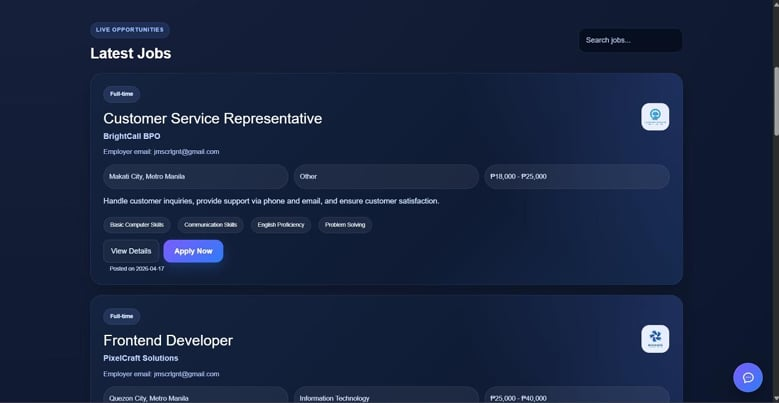

### ❓ FAQ Page
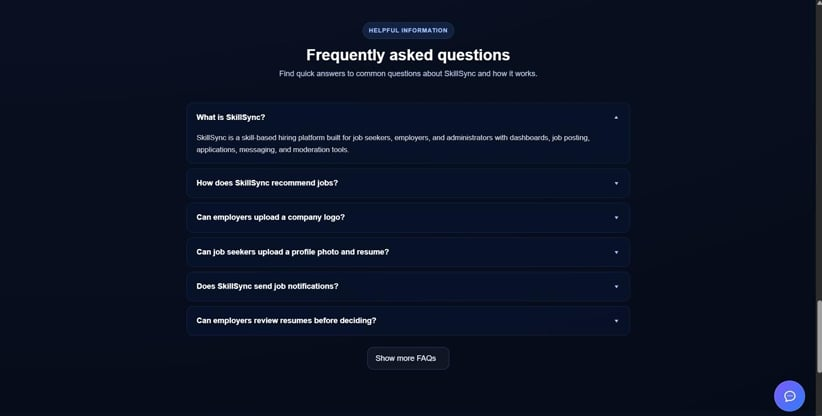

### 🤖 AI Assistant
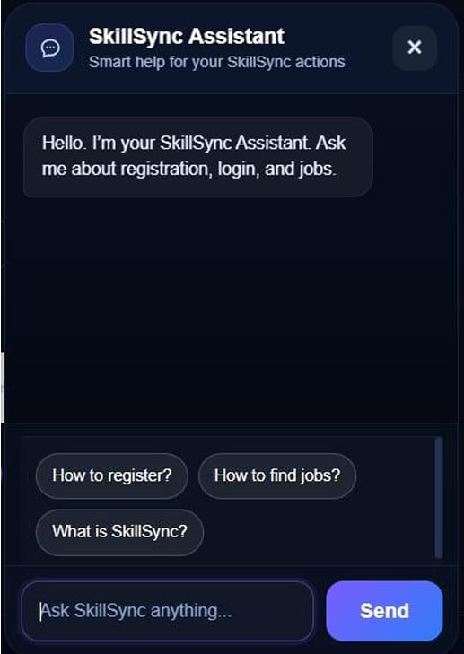

🔐 Authentication
### 📝 Register
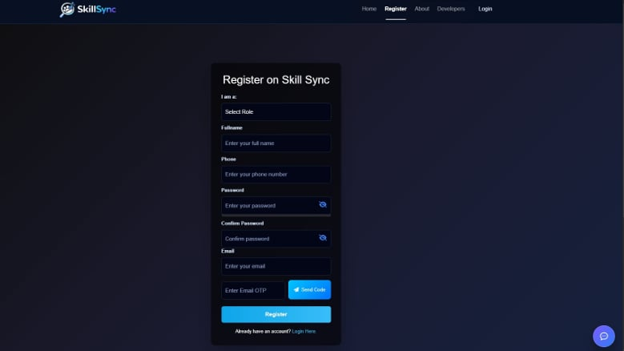

### 🔑 Login
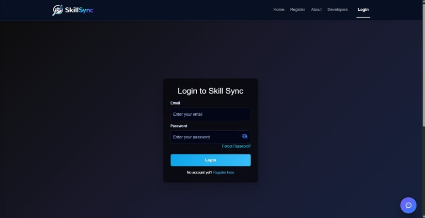

### 🔁 Forgot Password
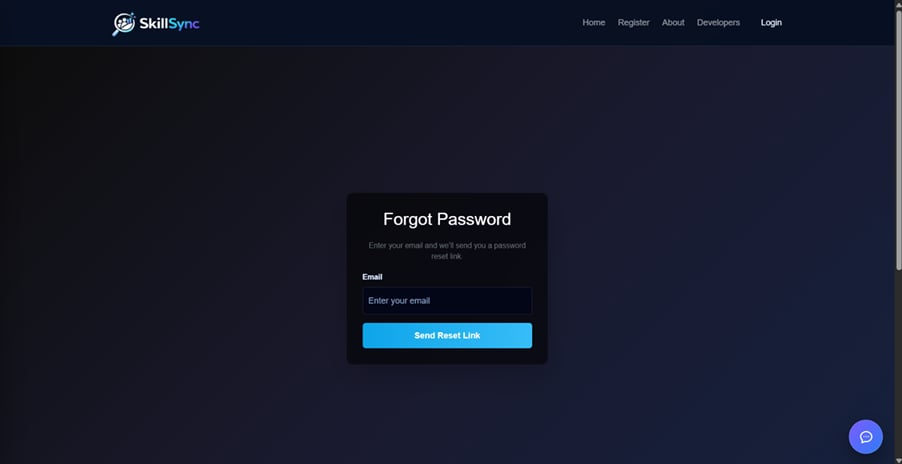

👤 Job Seeker
### 📊 Dashboard
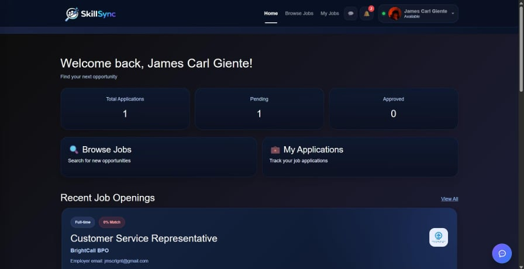

### 🎯 Job Recommendations
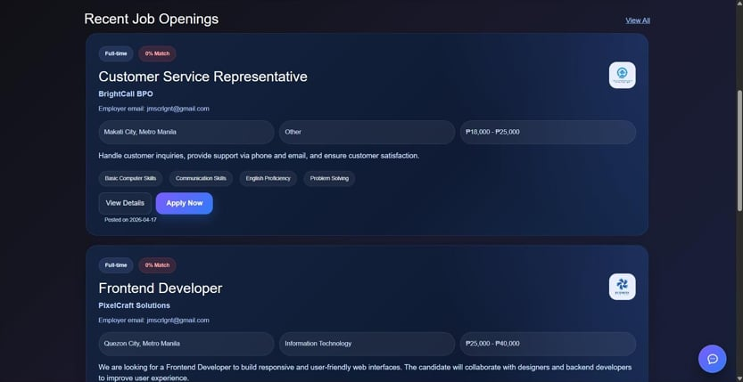

### 📋 My Applications
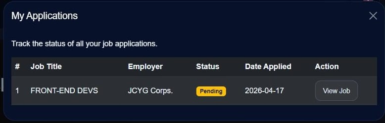

### 💬 Messaging
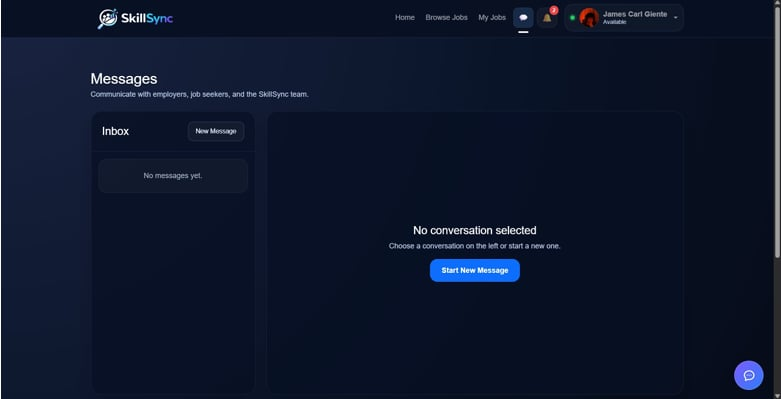

### 🔔 Notifications
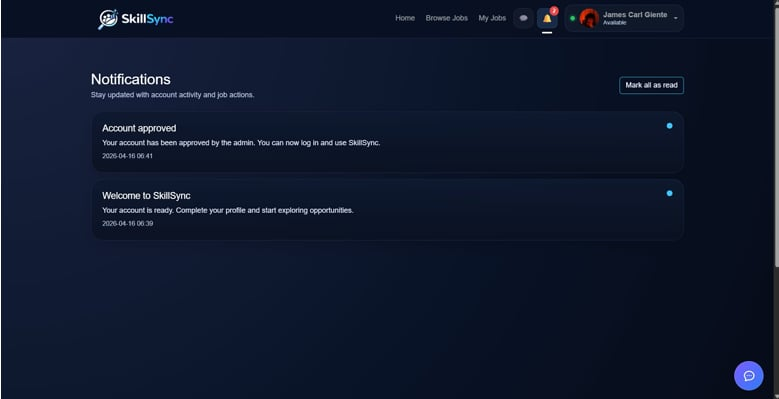

### 🧑 Profile
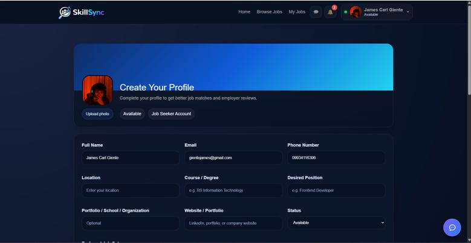

🏢 Employer
### 📊 Employer Dashboard
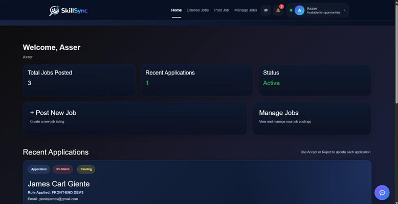

### ➕ Post Job
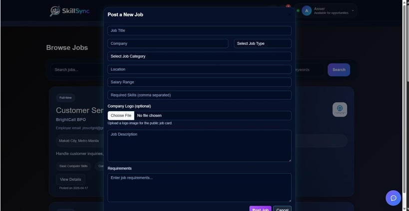

### 📁 Manage Jobs
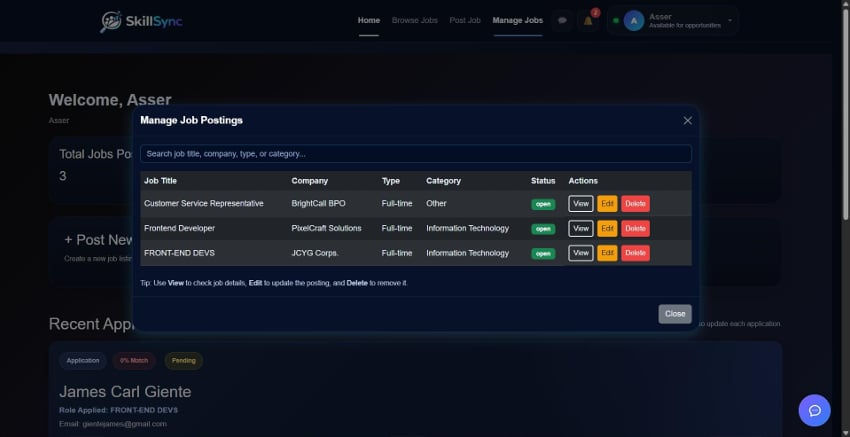

### 👥 Applicants
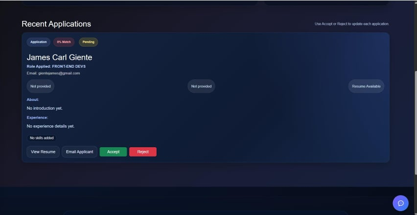

🛡️ Admin
### 📊 Admin Dashboard
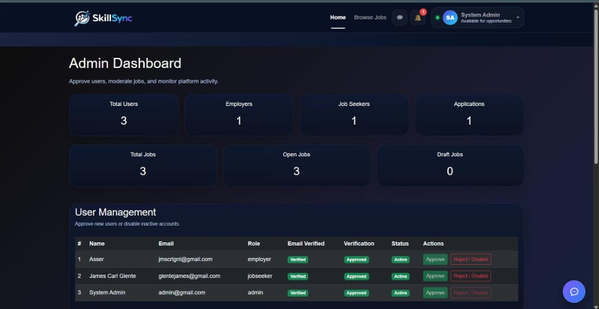

### 👤 User Management
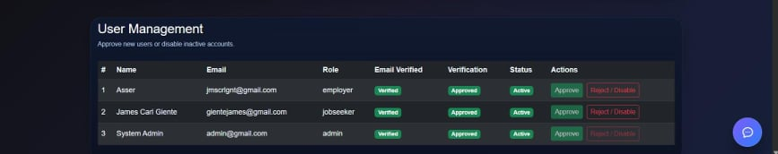

### 📄 Job Moderation
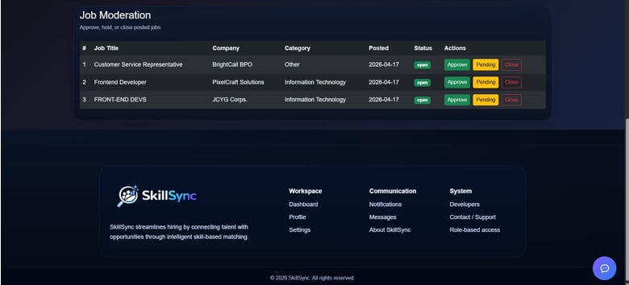

## ⚙️ Setup Guide

### 📦 Requirements
- PHP (v7.4 or higher)
- MySQL / MariaDB
- DBeaver (or any SQL client)
- Node.js (v16+ recommended)
- npm
- Web browser (Chrome recommended)

---

### 1. Clone the Repository
```bash
git clone https://github.com/jmscrlgnt/skillsync-job-matching-system.git
cd skillsync
```

### 2. Setup Database (DBeaver)
1. Open DBeaver
2. Create a new MySQL connection
3. Run:
```sql
CREATE DATABASE skillsync;
```
4. Import the SQL file located in:
```
/database/skillsync.sql
```

### 3. Configure Environment
1. Copy:
```
.env.example → .env
```
2. Edit `.env`:
```env
DB_HOST=localhost
DB_USER=root
DB_PASS=
DB_NAME=skillsync
```

### 4. Install Dependencies
```bash
npm install
```

### 5. Run Backend Server
```bash
node server.js
```

### 6. Run PHP Application
```bash
php -S localhost:8000
```

### 7. Open in Browser
```
http://localhost:8000
```

---

### Notes
- Ensure MySQL server is running before starting
- Run `server.js` for full system functionality
- Configure email settings if using PHPMailer
